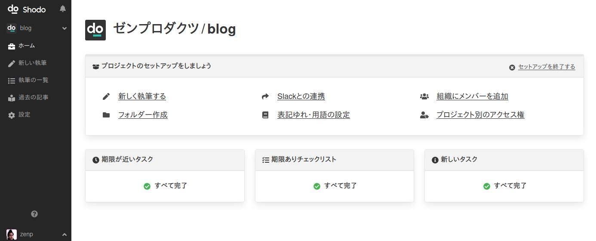
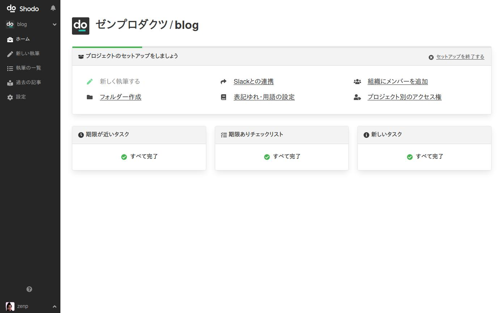

# Shodoを使ってみよう！

**Shodoにサインアップが終わると以下の画面が表示されます**。
もし表示されない方は https://app.shodo.ink/ にアクセスしなおして、サイドバーから作成したプロジェクト（`blog` など）をクリックしてください。

最初に **「新しく執筆する」をクリック** してください。

次に **「すぐに執筆」をクリック** してください。

以下のような画面が表示されますので、書きたい記事の内容を決めます。
最初は難しく考えず、**「テストの記事執筆」などのタイトルを入力**してください。
他はとくに入力しなくても問題ありませんので、**「すぐ執筆する」をクリック** してください。

すると、記事を執筆する画面に移動します。
執筆画面では、書きたい記事の内容を好きに書けます。
まずは試しに「テストの記事を書いています」などを書いてみましょう。他に色々操作してみても問題ありません。

一旦書き終われば**画面右上の「記事の版を作成」をクリック**してください。

記事を作成しようとすると、レビュー依頼するか確認されます。
今回はレビューせずに記事を完成としましょう。

**「レビューせず完成とする」をクリック**してください。

以下のように完成した記事を見られる画面が表示されます。

**「本文をコピー」をクリックすると記事をコピー**できます。

この執筆に関してやるべきことはすべて終わったので **「完了に変更」をクリック** してください。
記事を執筆するステータスが「完了」になりますので、これで執筆はおしまいです。

Shodoではバージョン（版）を重ねて執筆したり、他の人にレビューをもらったりもできます。
ですがそれらは一旦あとにしておきましょう。

**画面左のサイドバーにある「ホーム」をクリック**してプロジェクトのホームに戻りましょう。
また、初めの画面に戻ります。

一旦、記事を執筆することは試せました。
**今度からは、画面左のサイドバーにある「新しい執筆」から記事を執筆**できます。
初期設定の画面からは他にも、コラボレーションのために**組織のメンバーを招待**したり、**チャット（Slack）への通知を設定**したりできます。

## これからはどうすれば？

このあとは[執筆しよう](./create-a-task)からより詳しくガイドを読んでも良いですし、Shodoのアプリを動かして色々と試して見るのも良いでしょう。
プロジェクトや執筆は好きに作成できますし、**後から困ることはありませんので、気にせずにまずは使ってみてください**。

もし分からないことがあれば[お問い合わせ画面](https://shodo.ink/contact/)からもご連絡いただけますので、お気軽にご相談ください！
