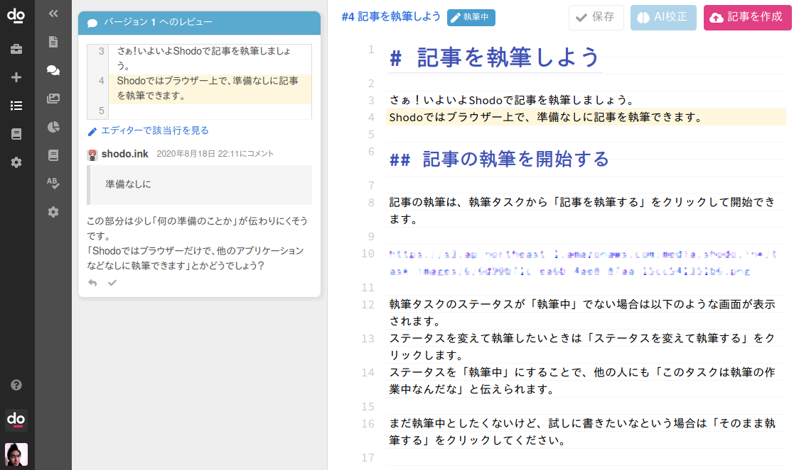

# レビューをもとに記事を修正する

レビュアーにレビューをもらったら、記事を修正して、新しいバージョンの記事を作成しましょう。
ここでレビューに対応して記事をブラシュアップする方法を説明します。
まずは、記事の執筆画面を開いてください。

## レビューに対応しよう

サイドバーから「レビュー」をクリックすると、投稿されたレビューコメントが閲覧できます。

レビュアーの人が残してくれたコメントが一覧できます。このコメントをもとに記事を改善していきましょう。
たとえば以下のように表示されます。

このとき「エディターで該当行を見る」をクリックすると、レビューコメントの対象行がハイライト表示されます。
修正すべき文章の位置に自動でスクロールしてくて、見やすく表示されるので便利です。

各レビューを確認して、エディターから本文を修正しましょう。
記事の修正ができたら、レビューを「解決」にします。レビューを解決にするには、レビューコメント下部のチェックアイコンをクリックします。

これで、このレビューは対応が完了したと記録できます。

すべてのレビューコメントについて対応できれば記事の修正は完了です。
再レビューを依頼する方法は後述します。

### レビューコメントに返信する

レビューコメントを読んで、単純に記事を修正して解決できない場合があります。
たとえばレビューコメントの意味が捉えられない場合や、レビューコメントと違った意見がある場合です。

レビューコメントに返信したい場合は、レビュー下部の矢印アイコンをクリックしてください。
返信したい内容を記入して「返信する」をクリックします。

レビューコメントに返信しつつ、レビューを解決にしても問題ありません。
レビュアーからの返答が必要な場合は、レビューを解決にせず、返信をしてそのままにしておきましょう。

## 再レビューの依頼をする

レビューコメントをすべて確認して対応できたら、執筆画面右上の「バージョンを作成」ボタンをクリックして記事を作成しましょう。
