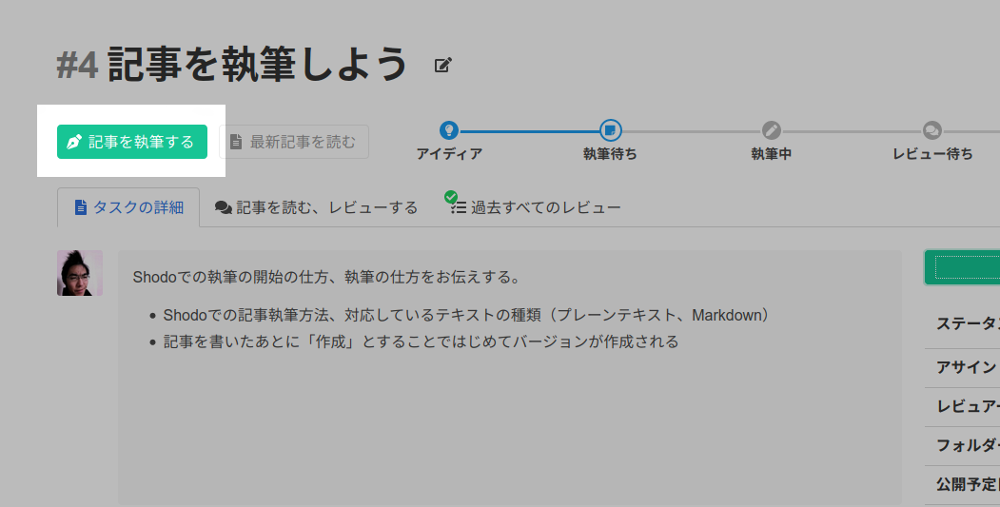
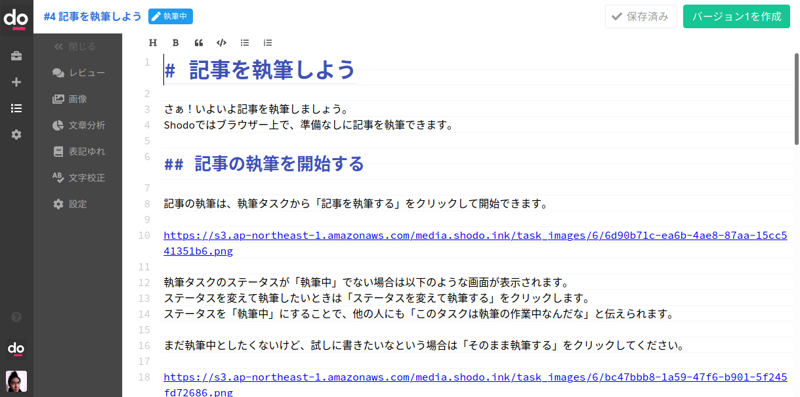
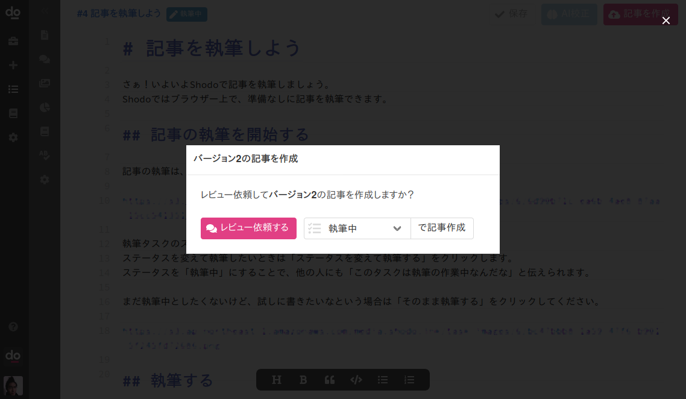

# 記事を執筆しよう

さぁ！いよいよShodoで記事を執筆しましょう。
Shodoではブラウザー上で、準備なしに記事を執筆できます。

## 記事の執筆を開始する

記事の執筆は、執筆タスクから「記事を執筆する」をクリックして開始できます。



執筆タスクのステータスが「執筆中」でない場合は以下のような画面が表示されます。
ステータスを変えて執筆したいときは「ステータスを変えて執筆する」をクリックします。
ステータスを「執筆中」にすることで、他の人にも「このタスクは執筆の作業中なんだな」と伝えられます。

まだ執筆中としたくないけど、試しに書きたいなという場合は「そのまま執筆する」をクリックしてください。


## 執筆する

いよいよShodoでの執筆です！
画面中央のエディター部分に記事を書けます。
書いた文章は自動でShodoに保存されますので、「保存」ボタンなどを逐次クリックする必要はありません。



記事を書くときは上から下に完成品を書く必要はありません。
まずは、書きたい内容の見出しを書くのが良いでしょう。
以下のように書きたいことを一覧に書いて、そこから内容を膨らませていくことをオススメします。

> 〇〇機能リリースのお知らせ
> 導入、1行説明
> 背景、なぜ必要か
> 詳細な機能の説明
> 利用開始の方法（求めるアクション）

### 記事が書けたらどうする？

記事が書き終わったら、「記事を作成」をすることではじめてチームメンバーに記事が共有されます。
「よし書き終わったな」という段階で画面右上の「バージョン1を作成」をクリックしてください。
以下のようにレビューを依頼するかどうかを聞く画面が表示されます。



ここでも記事を作成しつつ、執筆タスクのステータスを変更できます。
レビュアーにレビューの依頼をするときは「ステータスを変えて作成する」をクリックしてください。
「まだレビューの依頼はしないけど、記事としてまとめたいな」というときは「そのまま作成する」をクリックしてください。

これで、執筆タスクに設定している「レビュアー」にレビューを依頼した状態になります。執筆タスクに「レビュアー」を設定していない場合は設定しておきましょう。
レビュアーはShodoのダッシュボード画面からレビュー依頼されている執筆タスクを確認できます。
執筆者としては一旦ここで休憩になります。依頼されたレビューに対応する方法は次のページで説明します。

### サイドバーの説明

執筆画面の左にあるサイドバーから、エディターのいろいろな機能を使えます。
それぞれ、以下のようなことができます。

<table>
    <thead>
      <tr><th>要素</th><th>説明</th></tr>
    </thead>
    <tbody>
        <tr><th>レビュー</th><td>レビュアーからのレビュー一覧を確認できます</td></tr>
        <tr><th>画像</th><td>画像のアップロード、貼り付けができます</td></tr>
        <tr><th>文章分析</th><td>記事の単語比率や読了時間などの分析結果が見られます</td></tr>
        <tr><th>表記ゆれ</th><td>設定されている表記ゆれを確認できます</td></tr>
        <tr><th>文字校正</th><td>有効な文字校正ルールを確認できます</td></tr>
        <tr><th>設定</th><td>記事執筆のエディターを設定できます</td></tr>
    </tbody>
</table>

### Shodoで使えるフォーマットは？

Shodoでは現在、プレーンテキスト・Markdown形式に対応しています。
執筆画面の上部にあるツールバーから、見出し、太字、引用、コードなどのMarkdownのシンタックスを入力できます。

Markdownは以下のような、文章を書くことに特化したフォーマットです。

```
# 見出し1

こんにちは、文章。
**太字** や *斜め文字* を使えます。

- リスト1
- リスト2
- リスト3

他にも `print("Hello")` などのコード文字や、引用の表記もできます。

> 引用の文章
```

Markdownは、はてなブログ、WordPross（プラグイン導入時）に使える記法です。
HTMLに変換でき、プレーンテキストのままでも読みやすい特徴があります。
