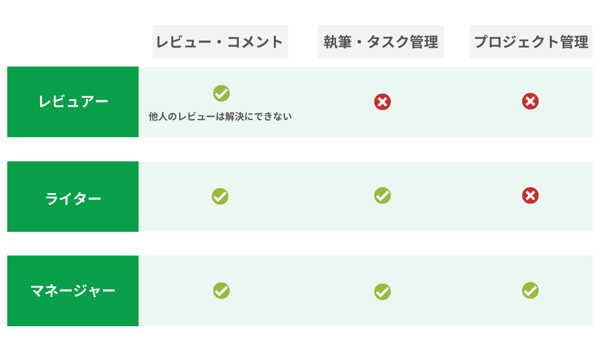

# 組織に招待するメンバーの権限管理

ロール管理、アカウントの権限管理は「ビジネスプラン」でのみのご提供となります。

組織に新しいメンバーを招待して、コラボレーションを通した記事の執筆をしましょう！

Shodoではメンバーのロール（役割）を設定して、アカウントの役割やできることを管理できます。
さらに、プロジェクトごとにアクセス権も個別に設定できます。

## メンバーの種類

プロジェクトのメンバーは2種類あります。

* オーナー：組織の管理をする人
* メンバー：記事のレビュー・執筆をする組織に属する人

ベーシックプラン・プレミアムプランでは、組織の作成者のみが「オーナー」となり、 
それ以外の招待したアカウントは「メンバー」となります。

## プロジェクトごとに、できることを管理しよう

Shodoでは、それぞれのプロジェクトごとにアカウントのロールを設定できます。
組織内のロールは「どういった所属の人か」を設定しますが、プロジェクトごとでは「何をする人か」を設定できます。

* マネージャー：プロジェクトの管理をする人
* ライター：プロジェクト内で記事の執筆、タスクの管理ができる人
* レビュアー：プロジェクト内で記事のレビューやコメントのみできる人

社内で記事を執筆してくれる人がいれば、「ライター」に設定しましょう。
記事を読んでレビューだけをしてほしい場合は「レビュアー」に設定します。
レビュアーの場合、記事の執筆をしたり他の人に記事のレビューを依頼することはできません。

組織の「メンバー」はデフォルトで「レビュアー」に、「オーナー」はデフォルトで「マネージャー」となります。
